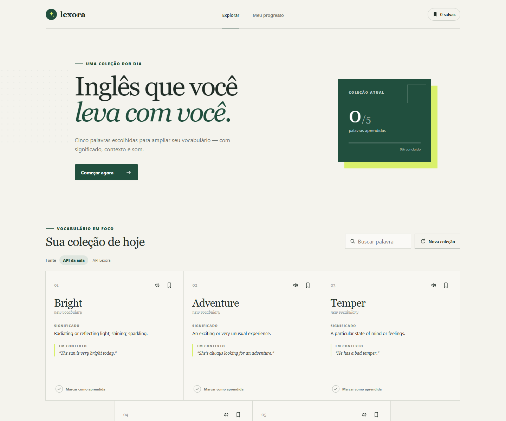
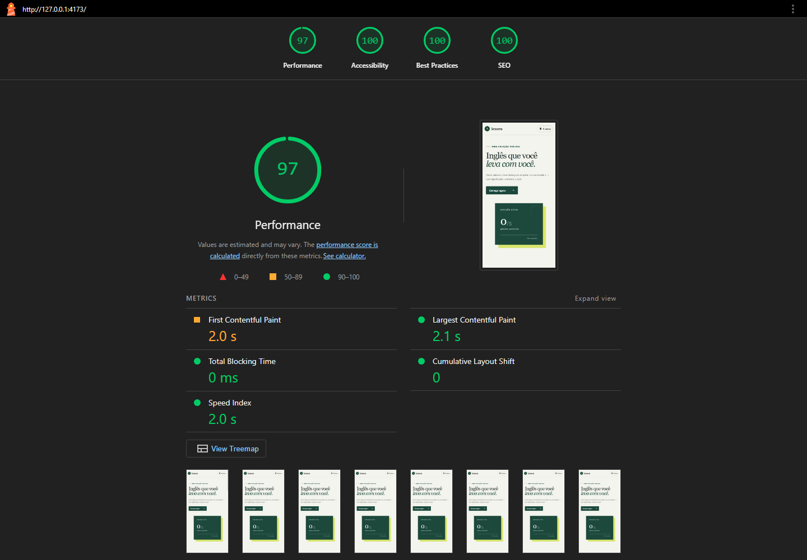

# Lexora

Uma experiência de estudo de vocabulário em inglês que transforma palavras, definições e exemplos em uma coleção diária simples de explorar. O projeto consome o BFF fornecido na disciplina de Front-end Engineering da FIAP e inclui uma API própria compatível.



## Funcionalidades

- Coleções de cinco palavras vindas da API da disciplina ou da API Lexora;
- busca instantânea por palavra, definição ou exemplo;
- pronúncia em inglês com a API nativa de voz do navegador;
- favoritos e progresso persistidos no `localStorage`;
- estados de carregamento, erro, resultado vazio e fallback local;
- layout responsivo, navegação por teclado e suporte a movimento reduzido;
- API própria com seleção aleatória de palavras e endpoint de saúde.

## Stack

- React 19
- Vite 7
- Node.js 20+
- Express 5
- CSS responsivo sem dependência de framework visual
- Node Test Runner para testes da API
- Render Blueprint para deploy

## Como executar

Pré-requisitos: Node.js 20 ou superior e npm.

```bash
npm install
```

Em dois terminais, inicie a API e a interface:

```bash
npm run dev:api
npm run dev
```

A interface estará em `http://localhost:5173` e a API em `http://localhost:3001/api/words`.

Para validar a versão de produção:

```bash
npm run test
npm run build
$env:NODE_ENV="production"; npm start
```

## Variáveis de ambiente

Copie `.env.example` para `.env` caso queira usar outra API:

```env
VITE_API_URL=https://sua-api.example.com/api/words
```

Sem essa variável, a interface permite alternar entre a API da disciplina e a API própria no seletor **Fonte**.

## Contrato da API

`GET /api/words` retorna cinco palavras. O parâmetro opcional `count` aceita valores de 1 a 12.

```json
[
  {
    "word": "Resilient",
    "description": "Able to recover quickly from difficulties.",
    "useCase": "The resilient team adapted after the original plan changed."
  }
]
```

Endpoints disponíveis:

- `GET /api/words?count=5`
- `GET /api/health`

## Deploy no Render

O arquivo `render.yaml` configura a aplicação e a API como um único Web Service. A API continua publicamente acessível em `/api/words`. Durante o build, o Render instala também as dependências de desenvolvimento necessárias para executar o Vite; o servidor continua rodando em modo de produção.

1. Publique este projeto em um repositório público no GitHub.
2. No Render, escolha **New > Blueprint** e conecte o repositório.
3. Confirme o serviço identificado pelo `render.yaml`.
4. Após o deploy, valide `/api/health` e `/api/words` na URL pública.

O mesmo projeto também pode ser implantado em Vercel ou Netlify, desde que a API Express seja adaptada para funções serverless ou publicada separadamente.

## Web Vitals e Lighthouse

Auditoria mobile executada no build de produção em 8 de setembro de 2026:

| Categoria | Nota |
| --- | ---: |
| Performance | 97 |
| Acessibilidade | 100 |
| Boas práticas | 100 |
| SEO | 100 |



O [relatório Lighthouse completo](docs/lighthouse-report.report.html) acompanha o repositório. Principais métricas aferidas:

| Métrica | Resultado | Significado |
| --- | ---: | --- |
| LCP | 2,1 s | Tempo até o maior conteúdo visível ser renderizado; mede o carregamento percebido. |
| FCP | 2,0 s | Tempo até o primeiro texto, imagem ou elemento visual aparecer. |
| TBT | 0 ms | Tempo em que a thread principal ficou bloqueada por tarefas longas. |
| CLS | 0 | Soma das mudanças inesperadas de layout; mede estabilidade visual. |
| Speed Index | 2,0 s | Velocidade com que o conteúdo da página se torna visualmente completo. |

Além dessas métricas de laboratório, o INP deve ser acompanhado em produção:

- **INP (Interaction to Next Paint):** latência observada entre uma interação e a próxima atualização visual; mede responsividade.

## Integrantes

- RM367574 — João Victor Deziderio Chinelato

## Entrega

Antes de gerar o PDF para o portal da FIAP, preencha:

- Integrante: `RM367574 — João Victor Deziderio Chinelato`
- Repositório público: `A DEFINIR`
- Site publicado: `A DEFINIR`
- API pública: `A DEFINIR/api/words`
- Relatório Lighthouse: `A GERAR APÓS O DEPLOY`

## Licença

Projeto acadêmico desenvolvido para a disciplina de Front-end Engineering da FIAP.
